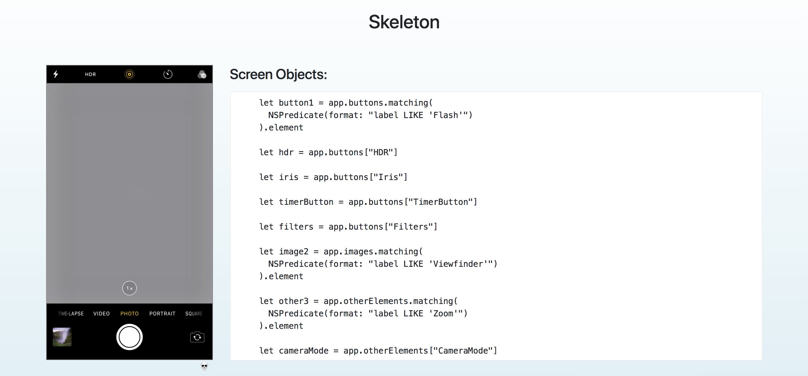

# skeleton
Tool for fast generating multi language page objects from iOS (device/simulator) and Android (devices/emulator) screens.

Prerequisites:
--------

#### Global
- Install [imagemagick](http://brewformulas.org/Imagemagick).

#### Android
- Install [SDK Tools](http://developer.android.com/sdk/installing/index.html?pkg=tools).
- SDK tools are added to your $PATH ([OSX](https://stackoverflow.com/posts/19764254/revisions)).
- Enable [USB Debugging](https://www.kingoapp.com/root-tutorials/how-to-enable-usb-debugging-mode-on-android.htm) on your device(s).

#### iOS
- Install [Xcode](https://developer.apple.com/xcode/download/).
- Install [Xcode Command Line Tools](http://railsapps.github.io/xcode-command-line-tools.html).
- Install [ideviceinstaller](http://brewformulas.org/Ideviceinstaller).

Installation:
------
    $ gem install skeleton-ui

Usage:
------
    1. Start skeleton server:
        $ skeleton server
    2. Open device screen
    3. Scan device screen via skeleton:
        $ skeleton scan -p android
        $ skeleton scan -p ios -b "your_app_bundle_id"
    4. Open page with the generated screen objects on your favorite language
    
    For more info use:
        $ skeleton -h
        $ skeleton scan -h
        
Demo:
------

    
Docs:
------

- [Setting up Skeleton for working with iOS real devices](https://github.com/alter-al/skeleton/blob/master/docs/real-ios-device-config.md)
- [Setting up RVM for deciding permissions problems](https://github.com/alter-al/skeleton/blob/master/docs/permissions_error.md)

## License

A tool is available as open source under the terms of the [MIT License](http://opensource.org/licenses/MIT).
